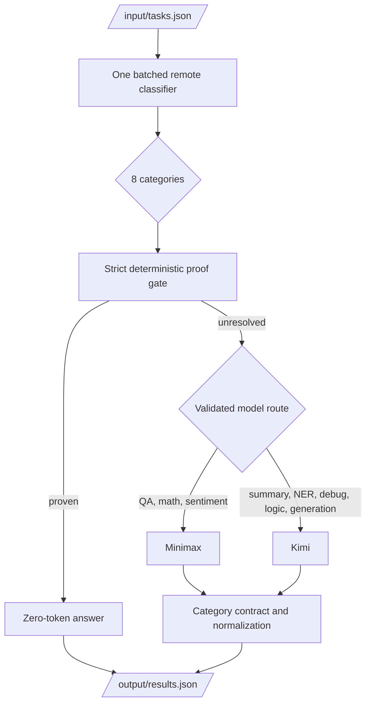

# Architecture and Results

Last updated: 2026-07-11. Current phase: token optimization after passing the
official accuracy gate.

## Decision baseline

| Metric | Current value |
|---|---:|
| Official accuracy | **94.7%** (approximately 18/19) |
| Official tokens | **12,012** |
| Official placement | previous reported rank 67th; Phase 1 rank not reported |
| Required accuracy | above 80% |
| Two additional misses | 16/19 = 84.2% |
| Three additional misses | 15/19 = 78.9% - below target |
| Frozen image | `jeffklin303/amd-router:phase1-direct-compression-20260711` |
| Frozen digest | `sha256:03dd918dd42bad832842456200c3ddd6678470e242d5b6c469aaf1f59def87fa` |

The project has a two-task floor margin. Token efficiency is now the goal, but
paired local regressions still require an explanation before promotion.

## Runtime architecture



### Stage responsibilities

1. `agent/main.py` reads tasks, deduplicates IDs, manages the deadline, and
   writes atomic snapshots.
2. `agent/classify.py` builds one compact classifier request for the task batch.
   Invalid or missing rows fall back to conservative local classification.
3. `agent/gate.py` accepts only deterministic answers supported by proof code.
4. `agent/remote.py` selects only from runtime `ALLOWED_MODELS`, sends every
   request through `FIREWORKS_BASE_URL`, retries transport failures, and records
   actual token usage.
5. `agent/contracts.py` supplies the category instruction, completion ceiling,
   and conservative output assembly.
6. The agent writes `[{"task_id":"...","answer":"..."}]` and exits 0.

### Validated primary routes

| Category | Primary | Reason |
|---|---|---|
| Actual QA | Minimax | strongest validated factual knowledge |
| Math | Minimax | validated accuracy with stronger reasoning |
| Sentiment | Minimax | validated label/aspect accuracy |
| Summarization | Kimi | strong transformation quality |
| NER | Kimi | 10/10 final affected-category gate |
| Code debugging | Kimi | strongest validated code route |
| Logic | Kimi | strong structured constraint answers |
| Code generation | Kimi | strongest validated code generation |

The judge may advertise additional model families. They remain fallbacks until
we can test them. The previous submission mismatch came from allowing the
official roster to move sentiment and NER onto untested Gemma primaries.

## What is and is not runtime classification

- The batched Fireworks classifier determines the category at runtime.
- `eval/score.py` grades development outputs and is not copied into the Docker
  runtime.
- Deterministic solvers answer a small proven subset; they do not estimate model
  correctness.
- A local ONNX classifier is a valid future token optimization, but it must match
  the current 160/160 audit and defer uncertain prompts remotely.

## Evidence

### Official

The latest saved submission scored **94.7%** (about 18/19) using **12,012
tokens**. It is the Phase 1 direct-output compression image. The previous rank
was 67th; no updated rank was reported.

### Local live release gates

| Artifact | Accuracy | Tokens | Requests | Errors | Wall |
|---|---:|---:|---:|---:|---:|
| `live-release-v2-accuracy-first-20260711` | 96.25% judged | 42,025 | 84 | 0 | 40.95s |
| `live-release-v3-accuracy-first-20260711` | 96.25% judged | 41,952 | 85 | 0 | 79.20s |
| `live-v2-ner-summary-release-final-20260711` | 19/20 | 15,616 | 21 | 0 | 18.28s |

Classifier-only audits were **80/80 on variants2** and **80/80 on variants3**.
This is why classifier replacement is an efficiency experiment, not the first
suspect for an answer-quality regression.

### Docker release gate

- Public repository: `https://hub.docker.com/r/jeffklin303/amd-router`.
- Platform: `linux/amd64`.
- Compressed archive measured by the build gate: 76,047,173 bytes (0.08 GB).
- Fresh public pull passed.
- Floor-C and Floor-CL smoke paths both produced valid `results.json`.

## Token optimization roadmap

### Phase 0 - token attribution (implemented)

Use the existing ledger to report tokens by:

- classifier stage;
- answer category;
- prompt vs completion;
- model;
- retries/fallbacks.

New ledger entries retain stage, category, model, reasoning effort, and attempt.
`scripts/live_benchmark.py` reports classifier and answer usage separately and
stores the same attribution in `benchmark.json`.

Measured across the two 80-task release gates:

| Stage | Tokens | Share |
|---|---:|---:|
| Remote classifier | 14,342 | 17.1% |
| Remote answers | 69,635 | 82.9% |

Answer completion tokens alone were 37,449, so the current global `high`
reasoning setting is a larger target than the classifier. The next submission
must replace the approximate 14,000 official-token figure with the exact value.

### Phase 1 - direct-output compression (submission candidate)

This phase combines one coherent direct-output policy:

- QA uses `reasoning_effort=none`;
- NER uses `none` for direct extraction but retains `high` for event and
  ambiguity prompts;
- QA, sentiment, and NER are batched by category and reasoning level;
- every batch row is validated and malformed rows rerun individually;
- NER batch payloads are converted to the exact JSON schema, including empty
  `none|NONE` responses.

Paired release result: 154/160 judged passes for both control and candidate,
83,977 -> 69,128 tokens (-17.7%), 169 -> 123 requests, zero remote errors.
The final empty-entity fix then passed the affected variants3 NER set 10/10.
The official result was 94.7% and 12,012 tokens, versus a 11,524-token forecast
(488 tokens, or 4.2%, above forecast).

### Phase 2 - selective local answering

The image is only about 0.08 GB against a 10 GB allowance, and the remote-only
runtime leaves substantial time inside the ten-minute limit. Test a bundled
quantized 1.5B-3B local answer model with accept-or-defer verification. Start
with short QA, sentiment, and code tasks; force uncertain, long, or structurally
complex prompts back to the current remote path. This is the first phase capable
of moving toward the leaders' roughly 1,500-token range.

### Phase 3 - local classifier, remote uncertainty fallback

Bundle a small CPU classifier such as an ONNX encoder. Do not use a multi-GB
chat model merely because the image limit allows it. Required gate:

- 160/160 on variants2 + variants3;
- cold start comfortably below 60 seconds;
- low-confidence prompts use the current remote batch classifier;
- no change to downstream category routes.

This removes the classifier's roughly 17% local-release share while keeping the
proven classifier as a safety net. It is useful, but it is not the first or
largest saving.

### Phase 4 - broader remote batching

After local offload is measured, test two model-oriented remote batches for the
remaining tasks. Preserve per-item contracts and fall back individually on any
malformed or unverifiable row.

### Phase 5 - cap tuning

Completion caps are ceilings, not guaranteed spend. Lower them only when the
ledger shows a meaningful long tail and truncation detection is available.
Use observed p95/p99 completions rather than arbitrary round numbers.

### Phase 6 - additional zero-token answers

Promote a deterministic or local answer only after 100% precision on applicable
public and OOD cases. A wrong local answer cannot be rescued by Fireworks.

## Candidate promotion matrix

| Gate | Required result |
|---|---|
| Compile/self-checks | all pass |
| Deterministic gate | 100% precision |
| Local candidate gate | 100% accepted precision |
| variants2 judged | at least 90%, no unexplained pass-to-fail |
| variants3 judged | at least 90%, no unexplained pass-to-fail |
| Remote errors/missing answers | zero |
| Token change | measured decrease |
| Scope | one optimization lever |
| Docker | public pull + amd64 + both smokes |

For the 19-task official set, prefer candidates that preserve all known answers.
If an official experiment falls to 84.2%, stop spending the last task of margin
until the regression is understood.

## Submission-calibrated forecasting

Each behavior-changing phase gets its own immutable image and official AMD
submission. Record it in `submission_history.csv`. Forecast the next result with
the paired local token ratio and local accuracy delta:

```powershell
python -m scripts.submission_forecast --baseline <v2-control.json> <v3-control.json> --candidate <v2-candidate.json> <v3-candidate.json>
```

The token prediction is `14,000 x candidate/control local token ratio` until an
exact official baseline is entered. Accuracy stays anchored to 17/19 and uses
only the paired local delta; the printed one-task sensitivity matters because
16/19 is 84.2% and 15/19 is 78.9%. Local absolute accuracy is not treated as a
hidden-score estimator.

## Retired guidance

The following are historical, not current instructions:

- treating 42.1%, 47.4%, 57.9%, 65.71%, or 87.5% as the active baseline;
- starting from an accuracy-recovery TODO;
- making Gemma a primary route without development access;
- changing multiple token levers in one image;
- assuming a 10 GB image allowance means a large local LLM is runtime-safe;
- using practice-set accuracy alone as a promotion decision.

Historical experiments remain available in Git history and ignored
`benchmark_runs/`; they should not dominate the current onboarding path.
