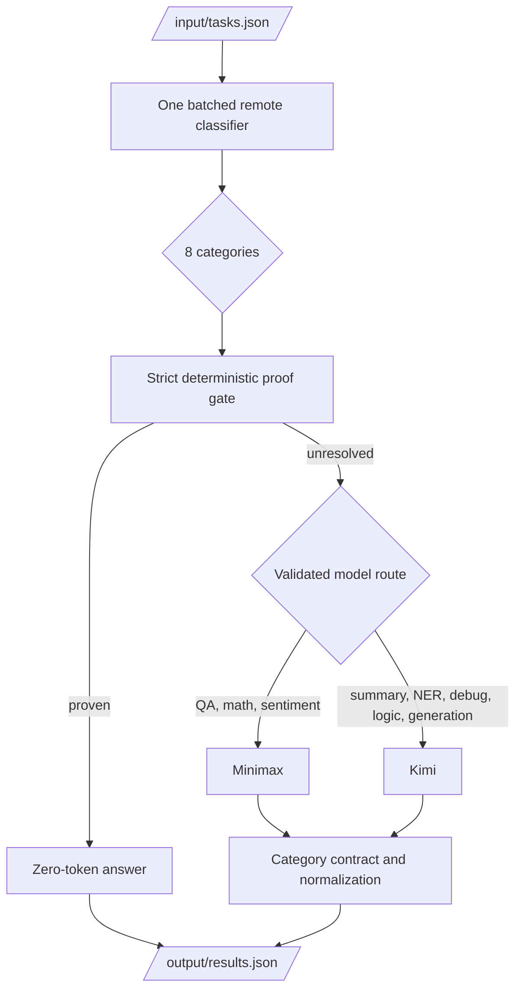

# Architecture and Results

Last updated: 2026-07-11. Current phase: token optimization after passing the
official accuracy gate.

## Decision baseline

| Metric | Current value |
|---|---:|
| Official accuracy | **89.5%** (approximately 17/19) |
| Official placement | **67th** |
| Required accuracy | above 80% |
| One additional miss | 16/19 = 84.2% |
| Two additional misses | 15/19 = 78.9% - below target |
| Frozen image | `jeffklin303/amd-router:accuracy-first-20260711` |
| Frozen digest | `sha256:fafd46eef741e6ef1660c05084a1893807572c50b650b85399266d04e82bc0bf` |

The project has one task of accuracy budget. Token efficiency is now the goal,
but avoiding a second additional miss is the release constraint.

## Runtime architecture

### Stage responsibilities

1. `agent/main.py` reads tasks, deduplicates IDs, manages the deadline, and
   writes atomic snapshots.
2. `agent/classify.py` builds one compact classifier request for the task batch.
   Invalid or missing rows fall back to conservative local classification.
3. `agent/gate.py` accepts only deterministic answers supported by proof code.
4. `agent/remote.py` selects only from runtime `ALLOWED_MODELS`, sends every
   request through `FIREWORKS_BASE_URL`, retries transport failures, and records
   actual token usage.
5. `agent/contracts.py` supplies the category instruction, completion ceiling,
   and conservative output assembly.
6. The agent writes `[{"task_id":"...","answer":"..."}]` and exits 0.

### Validated primary routes

| Category | Primary | Reason |
|---|---|---|
| Actual QA | Minimax | strongest validated factual knowledge |
| Math | Minimax | validated accuracy with stronger reasoning |
| Sentiment | Minimax | validated label/aspect accuracy |
| Summarization | Kimi | strong transformation quality |
| NER | Kimi | 10/10 final affected-category gate |
| Code debugging | Kimi | strongest validated code route |
| Logic | Kimi | strong structured constraint answers |
| Code generation | Kimi | strongest validated code generation |

The judge may advertise additional model families. They remain fallbacks until
we can test them. The previous submission mismatch came from allowing the
official roster to move sentiment and NER onto untested Gemma primaries.

## What is and is not runtime classification

- The batched Fireworks classifier determines the category at runtime.
- `eval/score.py` grades development outputs and is not copied into the Docker
  runtime.
- Deterministic solvers answer a small proven subset; they do not estimate model
  correctness.
- A local ONNX classifier is a valid future token optimization, but it must match
  the current 160/160 audit and defer uncertain prompts remotely.

## Evidence

### Official

The latest saved submission scored **89.5%** and reached **67th place**. The
reported result did not include its token count, so the official token baseline
is currently unknown.

### Local live release gates

| Artifact | Accuracy | Tokens | Requests | Errors | Wall |
|---|---:|---:|---:|---:|---:|
| `live-release-v2-accuracy-first-20260711` | 96.25% judged | 42,025 | 84 | 0 | 40.95s |
| `live-release-v3-accuracy-first-20260711` | 96.25% judged | 41,952 | 85 | 0 | 79.20s |
| `live-v2-ner-summary-release-final-20260711` | 19/20 | 15,616 | 21 | 0 | 18.28s |

Classifier-only audits were **80/80 on variants2** and **80/80 on variants3**.
This is why classifier replacement is an efficiency experiment, not the first
suspect for an answer-quality regression.

### Docker release gate

- Public repository: `https://hub.docker.com/r/jeffklin303/amd-router`.
- Platform: `linux/amd64`.
- Compressed archive measured by the build gate: 76,047,173 bytes (0.08 GB).
- Fresh public pull passed.
- Floor-C and Floor-CL smoke paths both produced valid `results.json`.

## Token optimization roadmap

### Experiment 1 - establish token attribution

Use the existing ledger to report tokens by:

- classifier stage;
- answer category;
- prompt vs completion;
- model;
- retries/fallbacks.

The official token count must be recorded on the next submission. Without it,
rank movement cannot be attributed to a local estimate.

### Experiment 2 - local classifier, remote uncertainty fallback

Bundle a small CPU classifier such as an ONNX encoder. Do not use a multi-GB
chat model merely because the image limit allows it. Required gate:

- 160/160 on variants2 + variants3;
- cold start comfortably below 60 seconds;
- low-confidence prompts use the current remote batch classifier;
- no change to downstream category routes.

This removes one remote classifier request and its prompt tokens while keeping
the proven classifier as a safety net.

### Experiment 3 - per-category reasoning effort

The current profile requests high reasoning globally. Add category-specific
effort and test one category at a time:

- first candidates for lower effort: sentiment, NER, summarization, simple QA;
- retain high effort initially: math, logic, debugging, generation.

Measure actual completion-token change. A lower setting that causes one extra
hidden miss consumes the entire safe accuracy margin.

### Experiment 4 - answer batching

Batch only one low-coupling category per experiment. Sentiment and NER are the
first candidates because their schemas are short and machine-checkable. Every
row must be independently validated and malformed rows must rerun individually.

### Experiment 5 - cap tuning

Completion caps are ceilings, not guaranteed spend. Lower them only when the
ledger shows a meaningful long tail and truncation detection is available.
Use observed p95/p99 completions rather than arbitrary round numbers.

### Experiment 6 - additional zero-token answers

Promote a deterministic or local answer only after 100% precision on applicable
public and OOD cases. A wrong local answer cannot be rescued by Fireworks.

## Candidate promotion matrix

| Gate | Required result |
|---|---|
| Compile/self-checks | all pass |
| Deterministic gate | 100% precision |
| Local candidate gate | 100% accepted precision |
| variants2 judged | at least 90%, no unexplained pass-to-fail |
| variants3 judged | at least 90%, no unexplained pass-to-fail |
| Remote errors/missing answers | zero |
| Token change | measured decrease |
| Scope | one optimization lever |
| Docker | public pull + amd64 + both smokes |

For the 19-task official set, prefer candidates that preserve all known answers.
If an official experiment falls to 84.2%, stop spending the last task of margin
until the regression is understood.

## Retired guidance

The following are historical, not current instructions:

- treating 42.1%, 47.4%, 57.9%, 65.71%, or 87.5% as the active baseline;
- starting from an accuracy-recovery TODO;
- making Gemma a primary route without development access;
- changing multiple token levers in one image;
- assuming a 10 GB image allowance means a large local LLM is runtime-safe;
- using practice-set accuracy alone as a promotion decision.

Historical experiments remain available in Git history and ignored
`benchmark_runs/`; they should not dominate the current onboarding path.
