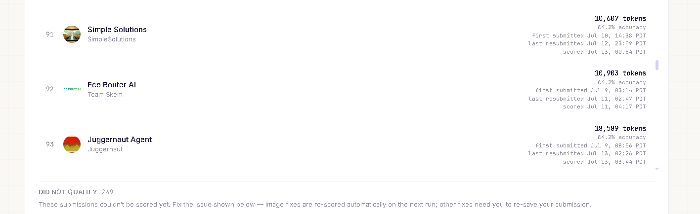
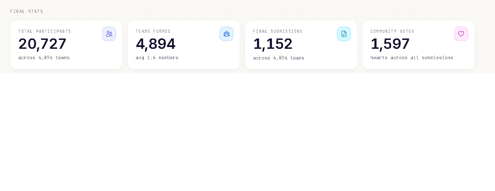

# Hybrid Token-Efficient Router

**AMD Developer Hackathon ACT II — Track 1 (General-Purpose AI Agent)**

An LLM router that answers a hidden benchmark of ~19 tasks across 8 categories,
scored on a **gate-then-rank** rule: clear 80% accuracy or score nothing, then
among passing submissions **the fewest API tokens wins**.

Final submission: **94.7% accuracy on 12,012 tokens** — up from a 42.1% first
attempt, across six graded submissions, three of which I caught as regressions
and rolled back.

<p align="center">
  
  <br>
  <em>Track 1's automated leaderboard: 143 submissions cleared the accuracy gate and were scored;<br>a further <strong>249 did not qualify</strong>. Ranking is by accuracy, ties broken by fewest tokens.</em>
</p>

<p align="center">
  
  <br>
  <em>Event scale: 20,727 participants, 4,894 teams, 1,152 final submissions across three tracks.</em>
</p>

---

## The submission log

Every behavior-changing build got its own Docker tag, a forecast, and a row in
[`submission_history.csv`](submission_history.csv). That ledger is the most
useful thing in this repo — it is the reason I know which of my "improvements"
actually made things worse.

| # | Submission | Accuracy | Tokens | Rank | Outcome |
|---|---|---:|---:|---:|---|
| 0 | Early iterations | 42.1% → 87.5% | — | — | The climb. Retired. |
| 1 | `accuracy-first` | 89.5% | ~14,000 | 67th | Cleared the gate. Now optimize tokens. |
| 2 | `phase1-direct-compression` | **94.7%** | **12,012** | — | ✅ **Best on both axes. Final submission.** |
| 3 | `phase2-aggressive` | 63.2% | — | — | ❌ **Failed the gate.** Scored nothing. |
| 4 | `phase3-safe-recovery` | 89.5% | 13,005 | 63rd | ❌ Worse on *both* axes. Reverted. |
| 5 | `phase4-classifier-compression` | 89.5% | 11,673 | — | ❌ Bought 339 tokens for a whole task. Reverted. |

The headline number is Phase 1. Everything after it was an attempt to beat it,
and everything after it lost. **Knowing that, and shipping Phase 1 anyway, was
the actual engineering work.**

### Phase 2: how I blew a submission

I stacked three token-saving levers into one build — a prefilter math gate, a
no-reasoning cut, and aggressive batching — because each looked safe in isolation
and I wanted to move fast. Local gates were green at 96.25%.

The hidden set returned **63.2%**. Below the 80% gate, so it scored zero.

The postmortem only worked because I was stamping `reasoning_effort` per request
into the run ledger. It turned up two independent failures: answer-path reasoning
had been cut off the tasks that needed it, *and* the classifier was silently
returning partial batches. Either one alone would have been survivable. I had
shipped both, and with three levers in flight I could not have told you which
was which.

Two rules came out of that, and they held for the rest of the competition:

- **One behavioral lever per submission.** No exceptions, no "these are related".
- **A green local gate is not a hidden-set result.** My devsets scored 96%+ on a
  build that scored 63% for real. Local gates catch regressions; they do not
  predict the hidden set.

### Phase 3 and 4: negative results, correctly identified

Phase 3 was the careful recovery — one lever, fully gated. It came back **89.5%
on 13,005 tokens**: one task *worse* and 993 tokens *more expensive* than Phase 1.
A clean loss on both axes.

Phase 4 attacked the classifier stage, which token attribution had measured at
17.1% of spend. It landed inside its forecast band (11,673 vs. a predicted
11,200–11,700) and still got rejected — it saved 339 tokens and cost a whole task.
The forecast was fine. The lever was just aimed at the wrong 17%; the
answer-generation path is 82.9% of the tokens and I had left it untouched.

Both were reverted. The frozen Phase 1 image was never overwritten, so reverting
was a tag change rather than a rebuild.

### Forecast calibration

Each candidate predicted its official token count from the paired local ratio
*before* submission, and the miss was recorded:

| Phase | Predicted | Actual | Miss |
|---|---:|---:|---:|
| 1 | 11,524 | 12,012 | +488 (4.2%) |
| 3 | 11,000 | 13,005 | +2,005 (18.2%) |
| 4 | 11,200–11,700 | 11,673 | in band |

Phase 3's miss was itself a signal: the excess was consistent with high-reasoning
NER forcing per-row fallback instead of batching — a mechanism I would not have
gone looking for without the gap between forecast and result.

---

## How the router works

```
/input/tasks.json
        |
        v
one batched classifier call  ──>  8 task categories
        |
        v
strict deterministic proof gate  ──proven──>  zero-token answer
        |
   unresolved
        v
validated category route
  Minimax: QA, math, sentiment
  Kimi:    summary, NER, debugging, logic, code generation
        |
        v
category contract + output normalization
        |
        v
/output/results.json
```

Three decisions carry most of the result:

**One batched classifier call, not one per task.** All tasks are labeled into 8
categories in a single request. The classifier is validated on paraphrased
out-of-distribution sets and scored **160/160**, which is what makes it safe to
route on.

**A deterministic proof gate that answers for free.** Tasks it can *prove* — not
guess — are answered locally at zero API cost. It accepts only proof-backed
answers, so it never trades accuracy for tokens.

**Per-category model routing with explicit output contracts.** Category-specific
schemas and normalization, with a cross-model retry for structurally incomplete
code. Models that could not be validated stay fallback-only rather than becoming
silent primary routes.

Full technical detail, evidence tables, and the token-attribution breakdown are
in [ARCHITECTURE.md](ARCHITECTURE.md).

---

## What I'd take to the next one

- **Instrument before you optimize.** Token attribution said the classifier was
  17.1% of spend and answer generation was 82.9%. I spent a submission on the 17%
  anyway. The measurement was sitting right there and I did not act on it.
- **The ledger is the product.** Six submissions, three regressions. Without a
  written prediction-vs-result row for each, "which change hurt us?" is
  unanswerable — the hidden set returns nothing but an aggregate score.
- **Freeze your best artifact.** The Phase 1 image and digest were never
  overwritten. Three separate rollbacks were free because of it.
- **Negative results are results.** Half this repo's value is a record of what
  did not work, and why.

---

## Running it

```bash
pip install -r requirements.txt
```

Free gates, before any paid experiment:

```powershell
python -m py_compile agent\classify.py agent\contracts.py agent\main.py agent\remote.py
python -m eval.score
python -m scripts.acceptance_p1
python -m scripts.live_benchmark --mock --out-dir .\benchmark_runs\mock-agent-check
```

Paid variant gates, only after the free ones pass:

```powershell
python -m scripts.live_benchmark --dataset eval\devset\variants2.json --score-judge --env-file .env.local --out-dir benchmark_runs\candidate-v2
python -m scripts.live_benchmark --dataset eval\devset\variants3.json --score-judge --env-file .env.local --out-dir benchmark_runs\candidate-v3
```

Forecast the official token delta from paired control/candidate reports:

```powershell
python -m scripts.submission_forecast --baseline <control-v2> <control-v3> --candidate <candidate-v2> <candidate-v3>
```

Build the submission image:

```bash
docker build --platform linux/amd64 -t router:submission .
```

The judging harness supplies `FIREWORKS_API_KEY`, `FIREWORKS_BASE_URL`, and
`ALLOWED_MODELS`. The router bundles no credentials and no hardcoded provider
model IDs; every remote request goes through the supplied base URL.

## Promotion rule

The rule that survived contact with the hidden set:

> Freeze the accuracy image. Change **one** lever. Compare paired outputs.
> Do not promote if either variant set regresses, a new remote error appears,
> or the official score drops below the gate.
